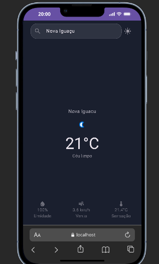
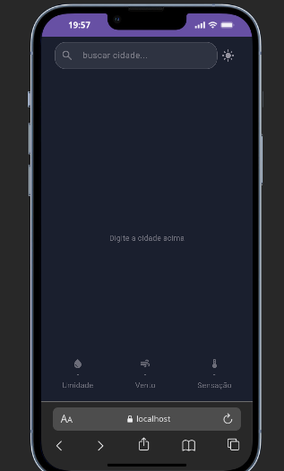
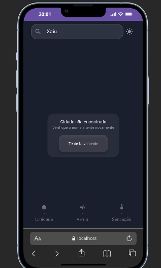
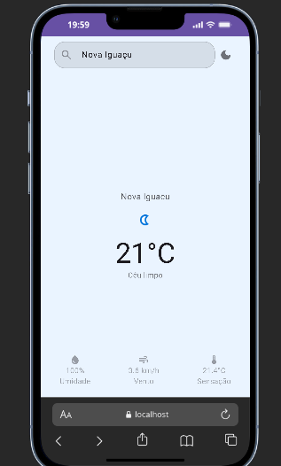
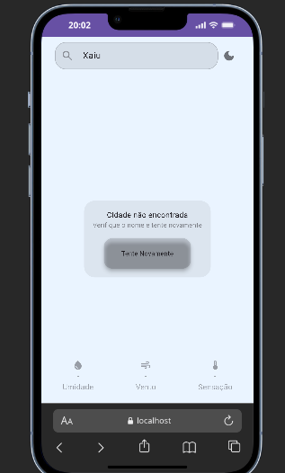

# 🌤️ Flutter Weather App

A clean weather app built with Flutter, consuming the [WeatherAPI](https://www.weatherapi.com/) REST API. Supports both Android and Web, with dark/light mode toggle.

## 📱 Screenshots
<p float="left">
  
  
  
</p>

### ☀️ Light Mode
<p float="left">
  
  
  
</p>

## 🚀 Features

- Search weather by city name
- Current temperature, condition, humidity, wind speed and feels like
- Dark / light mode toggle
- Error handling for invalid cities
- Supports accented characters (e.g. "São Paulo", "Brasília")

## 🛠️ Tech Stack

- **Flutter** (Dart)
- **WeatherAPI.com** — REST API for weather data
- **http** package for HTTP requests
- **ThemeMode** for dark/light switching
- Clean architecture: `models/`, `services/`, `screens/`

## 📁 Project Structure

```
lib/
├── main.dart
├── screen/
│   ├── search.dart
│   └── models/
│       └── weather_data.dart
└── services/
    └── weather_service.dart
```

## ⚙️ Getting Started

1. Clone the repo
```bash
   git clone https://github.com/Raphask/flutter-weather-app.git
```

2. Get dependencies
```bash
   flutter pub get
```

3. Add your WeatherAPI key in `lib/services/weather_service.dart`
```dart
   static const String _apiKey = 'YOUR_API_KEY';
```

4. Run the app
```bash
   flutter run
```

## 📄 License

MIT